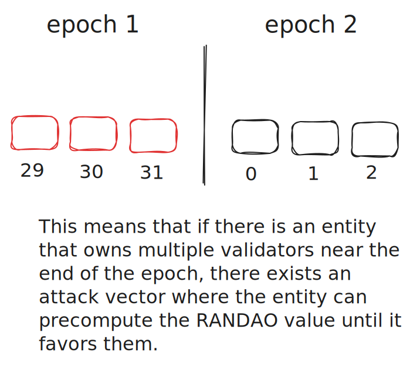

After Ethereum transitioned from Proof of Work (PoW) to Proof of Stake (PoS) in September 2022, a lot of things have changed on the consensus layer. 

This article will highlight some of the key changes in Ethereum 2.0 or as it is called now, the Beacon Chain.

Let dive in! 

## New Roles

Under PoW consensus, network participants were known as **miners** that raced to generate a unique hash with a fixed length of leading zeros to be able to add a new block to the blockchain. This required active usage of ASICs or GPUs which lead to high energy consumption.

However, under PoS consensus, network participants have transitioned from actively generating millions of hashes to voting and proposing a new block all under algorithmic control. These participants are called **validators**. This transition lead to reduction in energy consumption by 99.9% which helped in diminishing the negative sentiment of blockchain technology. ([source](https://cointelegraph.com/news/the-merge-brings-down-ethereum-s-network-power-consumption-by-over-99-9))  

## Introduction to Validators

Validator is a new role that didn't exist previously in PoW consensus. To be able to become a validator, you need to deposit/stake 32 ETH into a Beacon Chain client. ([Guide](https://launchpad.ethereum.org/en/) to get started on becoming a validator.)

In Beacon Chain, passage of time is organized into slots and epochs. A slot appears every 12 seconds and an epoch contains 32 slots (appears every 6.4 minutes) and it is used to create checkpoints to reach block/transaction finality which will get into it in later sections.

From the active pool of validators, a subset of validators can become either part of a committee or a block proposer or both! The selection processes are pseudorandom and determined by RANDAO. 

1. If a validator becomes a block proposer, the validator can propose a new block on the designated slot however, an empty slot can exist if the block proposer is inactive. (The validator is not penalized for not proposing a block.)

2. If a validator becomes part of a committee, each committee is delegated to each slot within an epoch to attest on the proposed block. More than one committee can exist in each slot. 

 
The assignments of committees and block proposer selection happens before an epoch starts. Specifically, they are determined at the end of previous epoch. 

## Achieving Decentralized Randomness with RANDAO 

On Beacon Chain, the role of RANDAO value is critical as it is used to determine the selection of committees and block proposers for each upcoming epochs. 

This value is determined by the following steps.

1. The block proposer in each slot goes through the process of **revealing** and **mixing**. 
- revealing: Revealing is a process of using a BLS signature scheme to create a signature in the current slot. The signature takes in message (current epoch number) and the validator's secret key. The signature is our RANDAO value. 
- mixing: We first verify whether the signature was actually created by the validator. This is possible by taking block proposer's public key, message and signature. If the signature is valid, we mix the value with the previous RANDAO value. This is done by doing a xor operation between previous RANDAO value and current revealed RANDAO value. 

The formula on mixing operation is : 

$$ Rn = Rn \oplus Bn-1  $$

Where, 

- $$ Rn $$ is the most recent revealed RANDAO value 
- $$ Bn-1 $$ is the RANDAO value after $$ n $$ contributions 

This process happens from slot 0 to 31 for each epoch and the final value in slot 31 is our RANDAO value which will be used to select the block proposer and committees for the next epoch.

Thus, the process of each block proposer revealing and mixing RANDAO value achieves decentralized randomness with high entropy (256 bit from secret key). However, this process can be vulnerable to a potential attack vector. 

### Example of Attack Vector

For this attack, assume that the Beacon Chain used hashing instead of xor operation to mix their RANDAO value. 

Given a scenario where an entity controls the last three block proposers (validators) as shown below. 

With these three block proposers, the malicious entity can commit to a **participation based attack** that can alter and precompute the RANDAO value to their favor.

## Attesting and Reaching Finality 

Validators vote or attest to a proposed block but they also attest on a given checkpoint. This is to ensure that past proposed blocks can reach finality which means that the blocks and its contained transactions are irreversible.

Two types of attestations: 

1. Attesting on individual block within a slot (LMD Ghost Vote)
2. Attesting on a checkpoint (FFG Vote)

## Types of Slashable Events 

## Sources

https://ethos.dev/beacon-chain#staking-rewards-and-penalties

https://launchpad.ethereum.org/en/

https://cointelegraph.com/news/the-merge-brings-down-ethereum-s-network-power-consumption-by-over-99-9

https://bitcoin.org/bitcoin.pdf

https://consensys.io/blog/the-ethereum-2-0-beacon-chain-explained

https://kb.beaconcha.in/ethereum-staking/rewards-and-penalties

https://eth2book.info/capella/part2/building_blocks/randomness/

