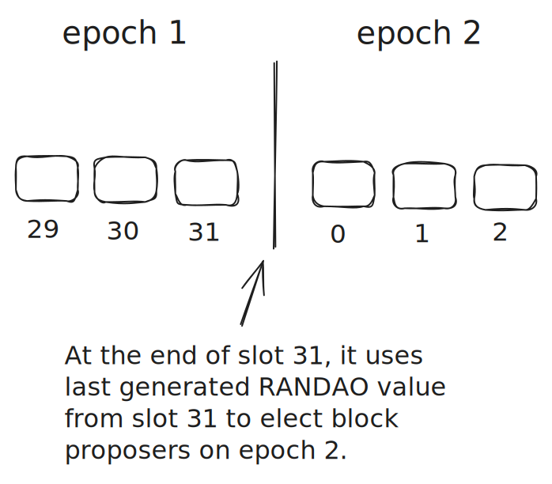
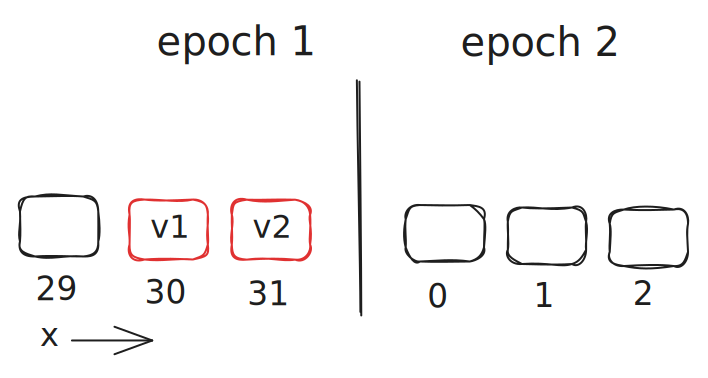

After Ethereum transitioned from Proof of Work (PoW) to Proof of Stake (PoS) in September 2022, a lot of things have changed on the consensus layer.

This article will highlight some of the key changes in Ethereum 2.0 or as it is called now, the Beacon Chain.

Let's dive in!

## New Roles

Under PoW consensus, network participants were known as **miners** that raced to generate a unique hash with a fixed length of leading zeros to be able to add a new block to the blockchain. This required active usage of ASICs or GPUs which lead to high energy consumption.

However, under PoS consensus, network participants have transitioned from actively generating millions of hashes to voting and proposing new blocks all under algorithmic control. These participants are called **validators**. This transition from PoW to PoS lead to reduction in energy consumption by 99.9%. ([source](https://cointelegraph.com/news/the-merge-brings-down-ethereum-s-network-power-consumption-by-over-99-9))

## Introduction to Validators

Validator is a new role that didn't exist previously in PoW consensus. To be able to become a validator, you need to deposit/stake 32 ETH into a Beacon Chain client. (<a href="https://launchpad.ethereum.org/en/" target="_blank">Guide</a> to get started on becoming a validator.)

On Beacon Chain, passage of time is organized into slots and epochs. A slot appears every 12 seconds and an epoch contains 32 slots (appears every 6.4 minutes) and it is used to create checkpoints to reach block/transaction finality which will get into it in later sections.


From the active pool of validators, a subset of validators can become either part of a committee or a block proposer or both! The selection processes are pseudorandom and determined by RANDAO.

1. If a validator becomes a block proposer, the validator can propose a new block on the designated slot however, an empty slot can exist if the block proposer is inactive. (The validator is not penalized for not proposing a block but it will miss out on the rewards.)

2. If a validator becomes part of a committee, each committee is delegated to a slot within an epoch to attest on the proposed block. 
- *A validator can only be part of one committee per epoch.*
- *More than one committee can exist in each slot.*
- *All committees are the same size and have at least 128 validators.*


The assignment of committees happens before a new epoch starts while block proposers are assigned once the epoch starts. 

Next, we will dive into the role of RANDAO which is used to select block proposers and committees.

## Achieving Decentralized Pseudorandomness with RANDAO

_Please note that I abbreviated a lot of details that goes into the RANDAO process. I made this choice to simplify and streamline the explanation. To learn more, please refer to the <a href="https://eth2book.info/capella/part2/building_blocks/randomness/" target="_blank">in-depth explanation</a> written by Ben Edgington._

<br/>

On Beacon Chain, the role of RANDAO value is critical as it is used to determine the selection of committees and block proposers for each upcoming epochs.

The RANDAO value goes through a series of reveal and mix process for each slot by the block proposer.  
- A block proposer is revealing and mixing their RANDAO value while also proposing a block.
- If a block proposer does not propose a block, it also does not contribute to the RANDAO value.

Revealing is simply the block proposer crafting a new RANDAO value in the proposed slot

- <a href="https://github.com/ethereum/consensus-specs/blob/7480d0334fd81cd029bc85b38c5c7bdc2967acbf/specs/phase0/validator.md?plain=1#L324-L329" target="_blank">Revealing</a>: Revealing is a process of using a BLS signature scheme to create a signature in the current slot. The signature takes in message (current epoch number) and the block proposer's secret key. The resulting signature is our RANDAO value. The last block proposer in each epoch finalizes the RANDAO value that will be used to elect block proposers and committees for the next epoch.


```python
def get_epoch_signature(state: BeaconState, block: BeaconBlock, privkey: int) -> BLSSignature:
    domain = get_domain(state, DOMAIN_RANDAO, compute_epoch_at_slot(block.slot))
    signing_root = compute_signing_root(compute_epoch_at_slot(block.slot), domain)
    return bls.Sign(privkey, signing_root)
```

<br/>

Mixing is the process of combining the current slot's RANDAO value with the previous mixed RANDAO value. Each block proposer collectively contributes to shuffling the RANDAO value which leads to a fair, decentralized way of electing block proposers and commitees on the next epoch.  

- <a href="https://github.com/ethereum/consensus-specs/blob/9d1e7087b3d0e5d3861b67dcf932158e26332fe3/specs/phase0/beacon-chain.md?plain=1#L1729-L1741">Mixing </a>: Before mixing, we first verify whether the signature was actually created by the validator. This is possible by taking block proposer's public key, message and signature. If the signature is valid, we do xor operation between the current revealed RANDAO value with the previous mixed RANDAO value.

```python
def process_randao(state: BeaconState, body: BeaconBlockBody) -> None:
    epoch = get_current_epoch(state)
    # Verify RANDAO reveal
    proposer = state.validators[get_beacon_proposer_index(state)]
    signing_root = compute_signing_root(epoch, get_domain(state, DOMAIN_RANDAO))
    assert bls.Verify(proposer.pubkey, signing_root, body.randao_reveal)
    # Mix in RANDAO reveal
    mix = xor(get_randao_mix(state, epoch), hash(body.randao_reveal))
    state.randao_mixes[epoch % EPOCHS_PER_HISTORICAL_VECTOR] = mix
```

<br/>

So to summarize, from slot 0 to 31, each block proposer reveals a RANDAO value and it fetches the previous mixed RANDAO value and does xor operation with the current revealed RANDAO value. The RANDAO value in the last slot (slot 31) or the most recent slot with proposed block in the current epoch is used to select the block proposer and committees for the next epoch. 



Thus, the process of each block proposer revealing and mixing RANDAO value achieves decentralized pseudorandomness with high entropy (256 bit from secret key). 

As always, the RANDAO process is not always perfect. We will look into a particular change that RANDAO underwent to improve the process.

### RANDAO Limitation and Mitigation

Let's look at a situation where Bob controls two validators that were chosen to be last two block proposers in an epoch (slot 30 and 31). Bob wants to precompute the best RANDAO value to his favor. 

Bob can precompute the best RANDAO value by: 

*Not proposing a block means that the RANDAO value remains unchanged* 

1. Proposing a block in both slot 30 and 31.
2. Proposing a block in slot 30 and not in slot 31 (Missing out reward in slot 31).
3. Proposing a block in slot 31 and not in slot 30 (Missing out reward in slot 30).
4. Not proposing a block in either slot 30 or 31 (Missing out reward in both slots).

In the case for #1, it is possible that if the order of validator is flipped, the final RANDAO value can be completely different. This might be an issue if Bob's two validators becomes part of the last two block proposers again but in the flipped order. This allows Bob to precompute a completely new set of RANDAO values that can favor him.  

However, the RANDAO limits the randomness by utilizing xor operation in the mixing process instead of hash operation to take advantage of its commutative property.

Justin mentions this example in a <a href="https://github.com/ethereum/consensus-specs/pull/496" target="_blank">discussion</a> that ultimately lead to reverting the mix operation to using xor operation instead of hash. 

If we refer to the function again, 

```python
def process_randao(state: BeaconState, body: BeaconBlockBody) -> None:
    epoch = get_current_epoch(state)
    # Verify RANDAO reveal
    proposer = state.validators[get_beacon_proposer_index(state)]
    signing_root = compute_signing_root(epoch, get_domain(state, DOMAIN_RANDAO))
    assert bls.Verify(proposer.pubkey, signing_root, body.randao_reveal)
    # Mix in RANDAO reveal
    mix = xor(get_randao_mix(state, epoch), hash(body.randao_reveal))
    state.randao_mixes[epoch % EPOCHS_PER_HISTORICAL_VECTOR] = mix
```

We can see from the last two lines that the mix operation uses xor operation on previous mixed RANDAO value and the current revealed RANDAO value. (We still utilize hash operation to reduce the size of the <a href="https://eth2book.info/capella/part2/building_blocks/randomness/#updating-the-randao:~:text=Second%2C%20the%20hash,of%20BLS%20signatures" target="_blank">revealed RANDAO value</a> from 768 bits to 256 bits.)

Let's look at an example to get a better understanding of why xor operation is better. 

### Hash vs XOR

Let's assume the entity controls the last two validators $$ v_1, v_2 $$ and the previous RANDAO value is $$ x $$ from slot 29. 

We also assume that the entity can have block proposers in flipped order. ($$ v_2 $$ in slot 30 and $$ v_1 $$ in slot 31) 


If we used hashing exclusively, there can be multiple unique RANDAO values:

Original order:
$$ hash(x, hash(reveal(v_1))) = y $$
$$ hash(y, hash(reveal(v_2))) = z $$

Flipped order:
$$ hash(x, hash(reveal(v_2))) = w $$
$$ hash(w, hash(reveal(v_1))) = p $$

As you can see, when the order is flipped, it generates completely new RANDAO values.

However, with xor operation, the result is same regardless of the order. 

Original order:
$$ xor(x, hash(reveal(v_1))) = a $$
$$ xor(a, hash(reveal(v_2))) = b $$

Flipped order:
$$ xor(x, hash(reveal(v_2))) = b $$
$$ xor(b, hash(reveal(v_1))) = a $$

The xor example retains the commutative property.

Of course, the entity can still generate multiple unique RANDAO values by selectively not proposing a block in a particular slot. However, xor's commutative property causes fixed randomness regardless of the order of the validators. 

## Supermajority

The state of beacon chain is determined by attesting at least $$ 2/3 $$ of the validator's collective effective balance. Reaching this threshold is called a supermajority. This terminology is widely used to determine checkpoints 
Given an attestation, the supermajority is the minimum number of validators that need to attest on the same block to reach finality. 
## Attesting and Reaching Finality

Validators attest to a proposed block but they also attest on checkpoints. Checkpoints,  the first proposed block in each starting epoch, act as the anchor for the current head of the chain. If a checkpoint passes, all the proposed blocks in the previous epoch and the slot where the first block is proposed also becomes valid. In a case where if a validator does not detect any checkpoint block in upcoming epochs, it will refer to last known epoch's checkpoint (starting block of that epoch) as the current head of the chain.

- If the current epoch's checkpoint passes, the previous checkpoint becomes *justified*.
 This is basically being in a pending state and it is waiting for the next checkpoint to be passed. Once the upcoming checkpoint passes, the previous epoch's checkpoint becomes finalized and the blocks up to where the previous checkpoint attestation occurred is considered valid. 
- It is possible that multiple epochs can refer to the same checkpoint as checkpoints in those epochs are still in justified state. 

 
- A checkpoint is either the proposed block in the first slot for each epoch or the most recently proposed block is called a checkpoint.
- There always exists a checkpoint in each epoch.
- A block can be a checkpoint for multiple epochs.
- A checkpoint accounts for the blocks in the previous epoch which means that the checkpoint that exists in the second epoch accounts for the blocks included in the first epoch. 
- A checkpoint that is accepted by the **supermajority** becomes *justified* and once the checkpoint that comes after also passes the supermajority, the previous checkpoint becomes *finalized*. Once the checkpoint is finalized, the consensus accepts that the proposed block up to the checkpoint is considered final.

The attestation to vote on a checkpoint is called a *FFG Vote* and the attestation is done by every validator assigned under the committee. 

A GHOST vote is done by individual validators that are delegated to a slot when a block is proposed. 


This leads to two types of attestations:

1. Attesting on individual block within a slot to determine the head of the chain (LMD Ghost Vote).
2. Attesting on a checkpoint to reach finality of an epoch (FFG Vote).

## Types of Slashable Events

## Sources

https://ethos.dev/beacon-chain#staking-rewards-and-penalties

https://launchpad.ethereum.org/en/

https://cointelegraph.com/news/the-merge-brings-down-ethereum-s-network-power-consumption-by-over-99-9

https://bitcoin.org/bitcoin.pdf

https://consensys.io/blog/the-ethereum-2-0-beacon-chain-explained

https://kb.beaconcha.in/ethereum-staking/rewards-and-penalties

https://eth2book.info/capella/part2/building_blocks/randomness/

https://github.com/ethereum/consensus-specs/pull/496
