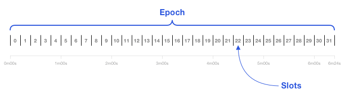
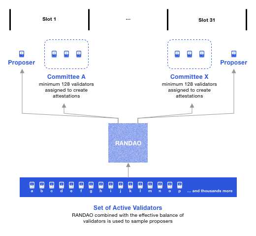
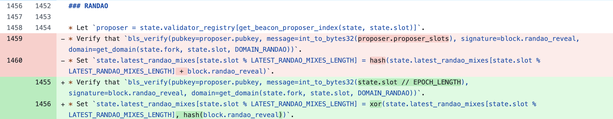

The Merge event occurred on September 15, 2022. This was a pivotal moment for Ethereum, as it transitioned from **Proof of Work** (PoW) to **Proof of Stake** (PoS) consensus. The new consensus introduced many changes, including new roles for network participants (now called validators), new ways of propagating/finalizing blocks and the concept of slashing. This article collects different concepts that are important to understanding the Beacon Chain. 

Let's dive in!

## Major Improvements From PoW  

Under PoW consensus, network participants (**miners**) competed to generate a valid hash under network's <a href="https://learnmeabitcoin.com/beginners/guide/difficulty/#:~:text=The%20difficulty%20is%20a%20number,new%20blocks%20to%20the%20blockchain." target="_blank">difficulty value.</a> Once the miner brute-forced a valid hash, they earned the right to propose a block and received a block reward upon acceptance of that block. Historically, on Ethereum,a PoW block was generated every ~12 seconds, and the difficulty level adjusted so that the block is produced at this rate. 

Over time, both the number of miners and the network's hash rate increased, causing the difficulty level to <a href="https://www.blockchain.com/explorer/charts/hash-rate" target="_blank">rise</a> as well. (The hash rate in Ethereum follows the same trend as Bitcoin's hash rate.) This created greater competition among miners, who had to generate even more hashes per second to earn the right to propose a block. Generating more hashes required additional ASICs or GPUs, increasing energy consumption to power and maintain the machines.

However, under PoS consensus, network participants no longer compete by hashing. Instead, they attest to and propose new blocks under algorithmic control. These participants are called **validators**, and this transition from PoW to PoS reduced Ethereum's energy consumption by <a href="https://ethereum.org/en/roadmap/merge/" target="_blank">99.95%.</a>

## Introduction to Validators

In Beacon Chain, a validator is a new role that didn't exist under PoW consensus. To become a validator, you need to deposit(stake) 32 ETH into a Beacon Chain client. *(See <a href="https://launchpad.ethereum.org/en/" target="_blank">official documentation</a> for detailed steps on becoming a validator.)*

On the Beacon Chain, the passage of time is organized into **slots** and **epochs**. 
- A slot appears every 12 seconds.
- An epoch contains 32 slots (so one epoch lasts 6.4 minutes) and is used to create checkpoints that help finalize blocks and transactions.



From the active pool of validators, a subset is randomly chosen to act as either part of a **committee** or a **block proposer** (or both). This random selection is determined by RANDAO.

- If a validator is chosen as a block proposer, it proposes a new block at its designated slot. (An empty slot may occur if the designated proposer is inactive, causing no block to be produced.)

- If a validator chosen to be part of a committee, it will attest to the proposed block during its slot within the epoch.

**Key Points**

- A validator is only part of one committee per epoch.
- More than one committee can exist in a single slot.
- All committees have the same size (at least 128 validators).



*Committee assignments happen before a new epoch begins, while block proposers are assigned once the epoch starts.* 

Next, let's see how RANDAO underpins these random assignments. 

## Achieving Decentralized Pseudorandomness with RANDAO

On the Beacon Chain, the **RANDAO** value is crucial for determining committee assignments and block proposers for upcoming epochs. Each slot's block proposer reveals a random value (*via BLS signatures*) and mixes it with the previously accumulated RANDAO state.

1. <a href="https://github.com/ethereum/consensus-specs/blob/7480d0334fd81cd029bc85b38c5c7bdc2967acbf/specs/phase0/validator.md?plain=1#L324-L329" target="_blank">**Revealing**</a>

- The block proposer for a given slot creates a BLS signature over the current epoch number using its **secret key**. This signature becomes the RANDAO value for that slot. If the proposer decides to not propose a block, it also does not contribute to RANDAO.


```python
def get_epoch_signature(state: BeaconState, block: BeaconBlock, privkey: int) -> BLSSignature:
    domain = get_domain(state, DOMAIN_RANDAO, compute_epoch_at_slot(block.slot))
    signing_root = compute_signing_root(compute_epoch_at_slot(block.slot), domain)
    return bls.Sign(privkey, signing_root)
```

2. <a href="https://github.com/ethereum/consensus-specs/blob/9d1e7087b3d0e5d3861b67dcf932158e26332fe3/specs/phase0/beacon-chain.md?plain=1#L1729-L1741">**Mixing**</a> 
- The revealed RANDAO value is **XORed** with the previously mixed RANDAO value stored in the state. This ensures that multiple validators collectively contribute randomness, leading to fair and decentralized selection of block proposers and committees in the next epoch. 

```python
def process_randao(state: BeaconState, body: BeaconBlockBody) -> None:
    epoch = get_current_epoch(state)
    # Verify RANDAO reveal
    proposer = state.validators[get_beacon_proposer_index(state)]
    signing_root = compute_signing_root(epoch, get_domain(state, DOMAIN_RANDAO))
    assert bls.Verify(proposer.pubkey, signing_root, body.randao_reveal)
    # Mix in RANDAO reveal
    mix = xor(get_randao_mix(state, epoch), hash(body.randao_reveal))
    state.randao_mixes[epoch % EPOCHS_PER_HISTORICAL_VECTOR] = mix
```

The final RANDAO value at the end of an epoch (or the most recent proposed slot) is used to select block proposers and committees for the next epoch. This design achieves decentralized pseudorandomness with high entropy (256 bits derived from each validator's secret key).


_For a deeper look at RANDAO and its intricacies, see Ben Edgington's <a href="https://eth2book.info/capella/part2/building_blocks/randomness/" target="_blank">in-depth explanation</a>._

### RANDAO Limitation and Mitigation

Let's look at a situation where Bob controls two validators that were chosen to be last two block proposers in an epoch (slot 30 and 31). Bob wants to precompute the best RANDAO value to his favor. 

Bob can precompute the best RANDAO value by: 

- Proposing a block in both slot 30 and 31.
- Proposing a block in slot 30 and not in slot 31 (Missing out reward in slot 31).
- Proposing a block in slot 31 and not in slot 30 (Missing out reward in slot 30).
- Not proposing a block in either slot 30 or 31 (Missing out reward in both slots).

*Note: Not proposing a block means that the RANDAO value remains unchanged.*

We can see that Bob has full control of what he can do with the two validators. He can strategically choose to *propose or not propose* blocks. He also has the option to precompute by changing the order of his validators.

Given this situation, in the previous iteration of the `process_randao` function, Bob would have maximum grinding opportunity that allowed him to generate new RANDAO values by changing the order of his validators. However, the function was improved by replacing hash  operation. XOR operation naturally carries commutative property which meant that the RANDAO value would be the <a href="https://notes.ethereum.org/@JustinDrake/rkPjB1_xr#:~:text=XORing%20vs%20hash,formal%20lower%20bounds." target="_blank">same</a> regardless of the order of the validators.

The change happened in the following <a href="https://github.com/ethereum/consensus-specs/pull/496" target="_blank">discussion</a> that ultimately lead to reverting back to the XOR operation instead of hash. 


*Specific <a href="https://github.com/ethereum/consensus-specs/pull/498/commits/438c013a8ca78095c690866bad23bfb7c6e97bbb" target="_blank">commit</a> to the change.*



We can see from the last two lines that the mix operation was changed to use XOR operation instead. (We still utilize hash operation to reduce the size of the <a href="https://eth2book.info/capella/part2/building_blocks/randomness/#updating-the-randao:~:text=Second%2C%20the%20hash,of%20BLS%20signatures" target="_blank">revealed RANDAO value</a> from 768 bits to 256 bits.) The change has greatly reduced the randomness that Bob could've taken advantage of to precompute new RANDAO values that can favor his validators on next epoch. 

## Supermajority

On the Beacon Chain, the head of the chain is determined once at least two-thirds of the validators’ <a href="https://eth2book.info/capella/part2/incentives/balances/#li_2" target="_blank">**effective balance**</a> has attested to a particular checkpoint. Because finality depends on reaching this threshold, an entity controlling 33% or more of the total stake can disrupt or delay consensus by preventing the network from achieving a supermajority. 

## Attesting and Reaching Finality

On the Beacon Chain, validators issue two primary types of votes:

1. **LMD GHOST Vote** - Attesting to a proposed block within a slot to help the network agree on the head of the chain. 
2. **FFG Vote** - Attesting to a checkpoint to confirm the finality of past proposed blocks.  

### Checkpoints as Anchors

A **checkpoint** is typically the fist proposed block at the start of each epoch (or the most recently proposed block if none appeared in that epoch's first slot). These checkpoints serve as *anchors* for the chain. Validators not only attest to the individual blocks in each slot but also to these checkpoints. 
- If a checkpoint reaches a supermajority, the chain deems that checkpoint is *justified*. 
- Once the next checkpoint is also justified, the previous checkpoint becomes *finalized*. 

### How This Ensures Finality

1. **Checkpoint justification -> Finality** 
- If the current epoch's checkpoint passes, the previous epoch's checkpoint becomes justified. It waits for the subsequent checkpoint to pass in order to reach finality. This means a checkpoint accounts for the blocks in the previous epoch. For instance, the second epoch's checkpoint covers all blocks that appeared in the first epoch and the second epoch's checkpoint block. 
- When the next checkpoint is also justified, the previous one is then finalized. All blocks leading up to that finalized checkpoint slot are considered irreversible unless a large share of validators (~33%) risk slashing themselves. 

2. **Referencing Past Checkpoints**
- Because epochs move in 32-slot intervals, it's possible multiple epochs refer to the same checkpoint when there hasn't been a newly proposed block at the start of an epoch, or if finality hasn't advanced.
- If a validator sees a no new checkpoint in upcoming epochs, it continues to reference the last known checkpoint as the chain's head. 

3. **Every Epoch Has a Checkpoint**
- Even if the first slot in an epoch is empty, the protocol design ensures each epoch includes a block designated as its checkpoint. 

By combining **LMD GHOST vote** to choose the latest head of the chain with **FFG vote** to justify and finalize checkpoints, the Beacon Chain achieves both liveness (the ability to keep producing new blocks) and safety (the assurance that finalized blocks cannot be reverted without severe penalties to misbehaving validators).

## Brief Introduction to Slashing

It is vital that validators attest to the right blocks and checkpoints to reach finality. To enforce that finality is always truthful, those that attest to blocks that have reached supermajority are rewarded while those attest to untruthful blocks are punished. A truthful validator can also report a malicious validator by reading on-chain events and this is known as a <a href="https://eth2book.info/capella/part2/incentives/slashing/#the-whistleblower-reward" target="_blank">whistleblower reward</a>.

A malicious validator will be **slashed** from their total stake thus decreasing their effective balance. Lower effective balance can lead to less influence during attestations and less chance to be selected as a block proposer.

List of events that are subjected to slashing can include:

1. Attesting to a block that is not finalized later. 
2. Not attesting to a block in an assigned slot (inactivity). 
3. Double proposal: proposing more than one block in a slot.

## Final Thoughts

In summary, the Beacon Chain brings major improvements by replacing PoW's high-energy hashing competition with a more efficient system of validators and attestations. The RANDAO mechanism (chaining BLS signatures) create a fair, decentralized source of randomness, while checkpoints provide a robust method to finalize blocks. Finally, slashing enforces honest behavior by penalizing different types ofmalicious actions. Together, these innovations help Ethereum remain secure, efficient, and decentralized. 
